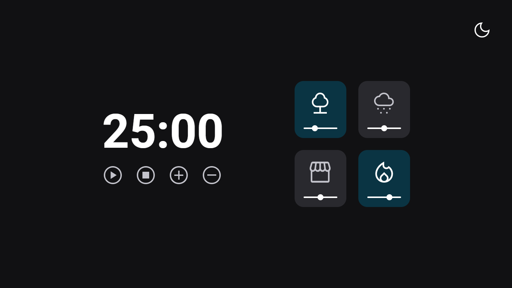

<h1 align="center">FocusTimer - Versão 3.0</h1>

Este é mais um projeto para estudos do curso da Rocketseat, o Explorer. Este é uma versão melhorada do projeto anterior. Acrescentamos o botão de DarkMode.  

  <a href="#-tecnologias">Tecnologias</a>&nbsp;&nbsp;&nbsp;|&nbsp;&nbsp;&nbsp;
  <a href="#-projeto">Projeto</a>&nbsp;&nbsp;&nbsp;|&nbsp;&nbsp;&nbsp;
  <a href="#-layout">Layout</a>&nbsp;&nbsp;&nbsp;|&nbsp;&nbsp;&nbsp;
  <a href="#memo-licença">Licença</a>

  

 

  

## 🚀 Tecnologias

Esse projeto foi desenvolvido com as seguintes tecnologias:

- HTML e CSS
- JavaScript
- Git e Github
- Figma

## 💻 Projeto

Esta aplicação tem como objetivo calcular o IMC (Índice de Massa Corporal) de uma pessoa, a partir do peso em Kg e a altura em cm. Com esse IMC você consegue verificar a sua saúde e classificação de obesidade.

- [Acesse o projeto finalizado, online](https://gustavopareschi.github.io/focustime2)

## 🔖 Layout

Você pode visualizar o layout do projeto através [DESSE LINK](https://efficient-sloth-d85.notion.site/FocusTimer-Vers-o-2-0-2e273fa9212a432eae6b51dda3c695940). É necessário ter conta no [Figma](https://figma.com) para acessá-lo.

## :memo: Licença

Esse projeto está sob a licença MIT.

---

Feito com ♥ by Rocketseat :wave: [Participe da nossa comunidade!](https://discord.gg/rocketseat)